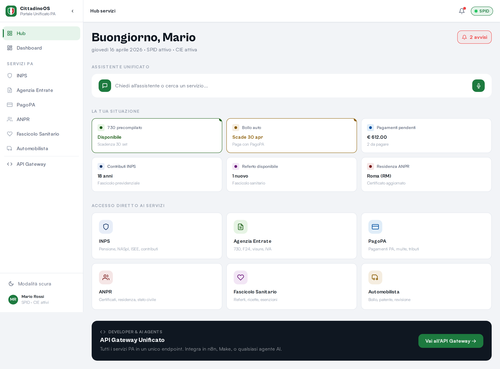
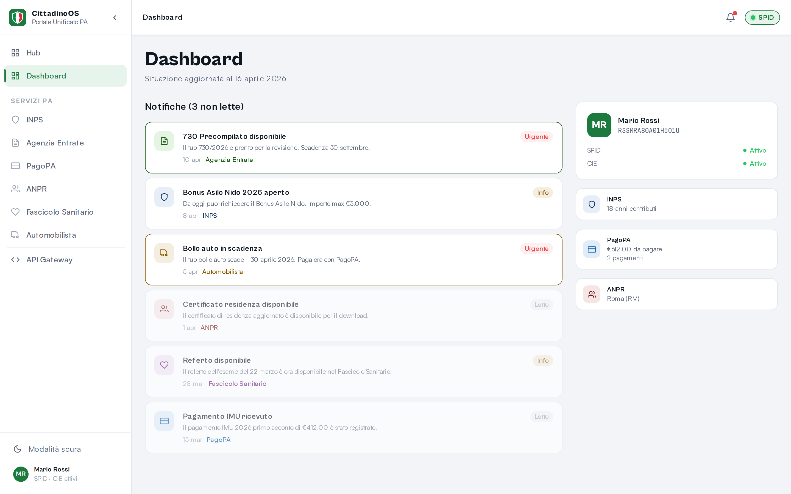
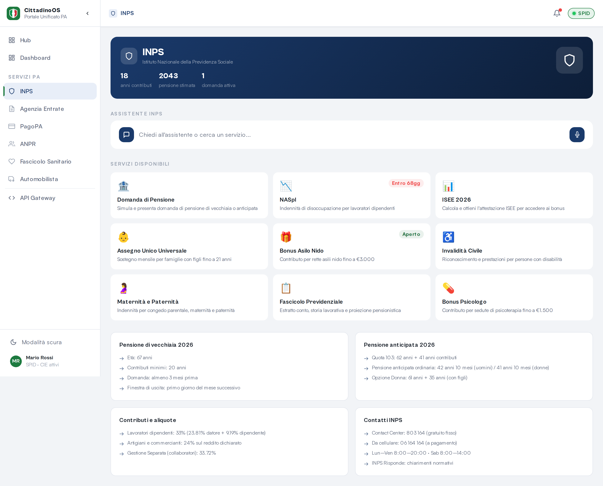
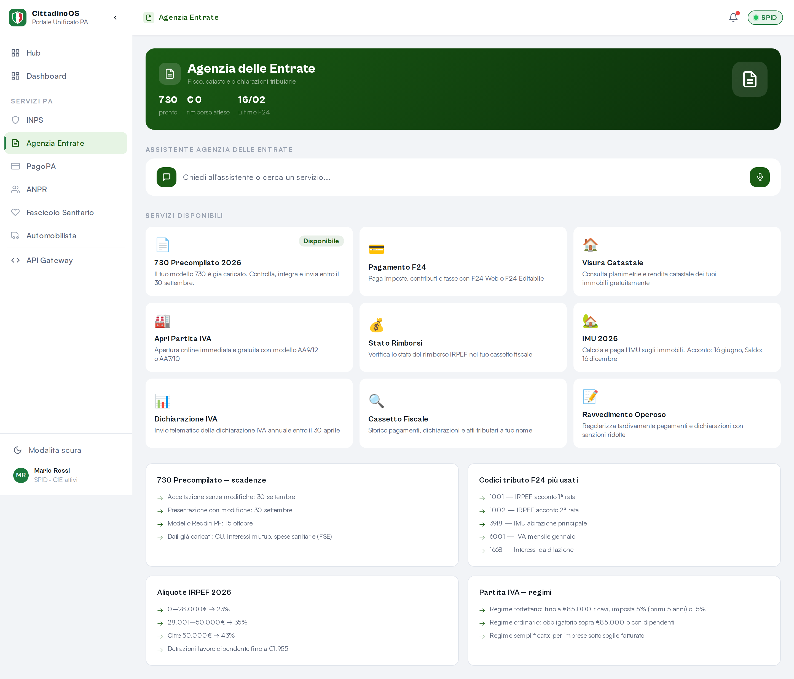
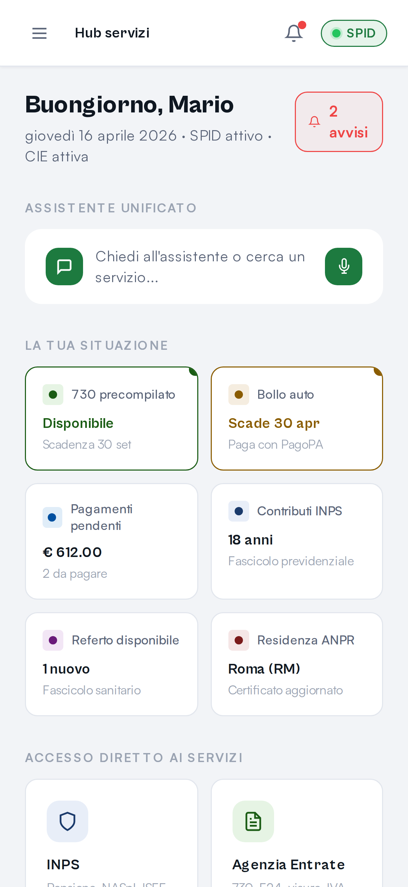
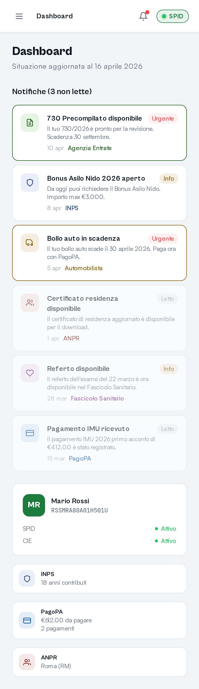
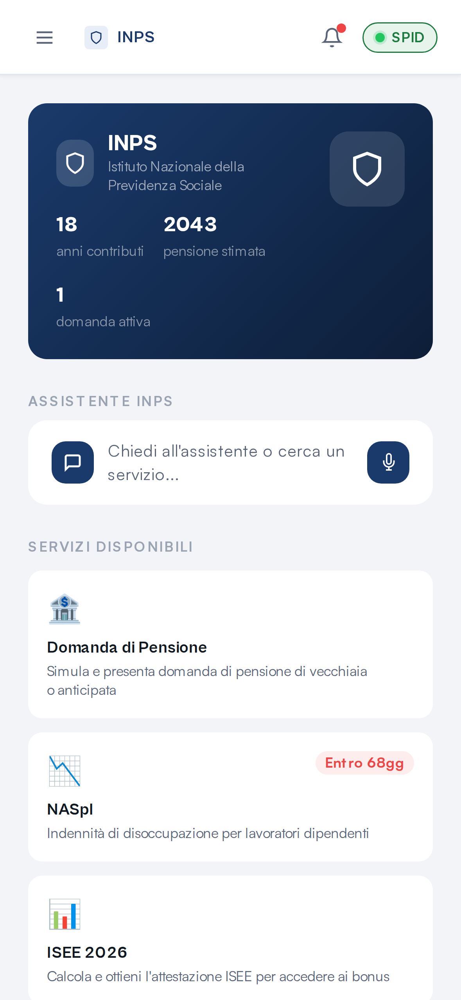
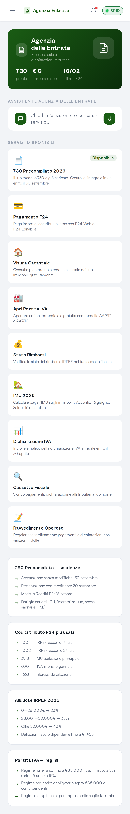
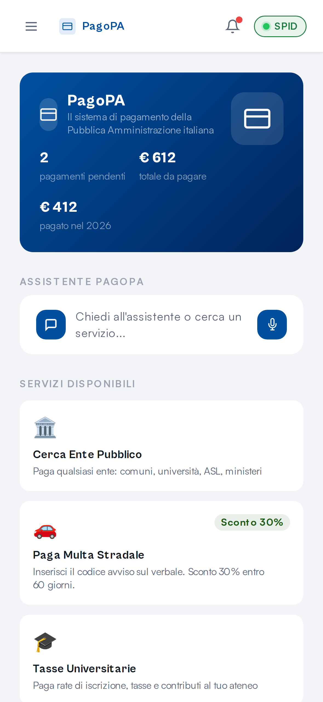
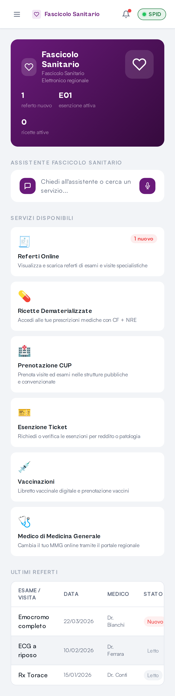

# 🇮🇹 Portale Italia

> **Il layer di orchestrazione che unifica i servizi della PA italiana in un'unica interfaccia conversazionale.**

> ⚠️ **PoC educativo e di advocacy.** I dati sono simulati. Non integra sistemi PA reali. Nessun dato personale viene raccolto o trasmesso.

Portale Italia non è un mockup: è un prototipo funzionante costruito per dimostrare che il collo di bottiglia della burocrazia digitale italiana non è più tecnologico, ma di design.

🔗 **Live Demo:** [portale-italia.online](https://portale-italia.online)

## 🚀 Cosa fa

- **Hub unificato:** INPS, Agenzia Entrate, PagoPA, ANPR, Fascicolo Sanitario, Automobilista — tutto in un posto
- **Assistente AI integrato:** Contesto cross-piattaforma. Chiedi "come pago il bollo?" e ti guida nel modulo giusto
- **Dark mode nativa**
- **Design accessibile e responsive** — funziona su desktop e mobile
- **API Gateway unificato** per sviluppatori e agenti AI

## 🌐 Benchmark Internazionali

Il pattern architetturale di Portale-Italia segue la direzione già tracciata da tre modelli di riferimento globali. Questo PoC esplora la fattibilità di quel modello nel contesto italiano, dimostrando che il gap non è tecnologico — è di volontà e design.

- **🇪🇪 Estonia — Bürokratt:** Assistente AI unificato (dal 2020) che aggrega servizi pubblici eterogenei in un'interfaccia conversazionale accessibile via testo, voce o lingua dei segni. Pattern "generative UI over legacy systems." [→ e-estonia](https://e-estonia.com/estonia-and-automated-decision-making-challenges-for-public-administration/)
- **🇬🇧 UK — AI Opportunities Action Plan 2025:** Governo britannico con partnership Anthropic per costruire un AI assistant per i servizi pubblici. "Humphrey" per i civil servant. Risparmio stimato: £45 miliardi/anno. [→ techUK](https://www.techuk.org/resource/uk-government-brings-further-ai-capability-into-public-services.html)
- **🇸🇬 Singapore — Singpass:** 2.700 servizi di 800 enti accessibili da una singola identità digitale unificata. 41 milioni di transazioni al mese. Il modello più maturo di "single entry point" per i servizi PA. [→ tech.gov.sg](https://www.tech.gov.sg/products-and-services/for-citizens/digital-services/singpass/)

## 📸 Screenshot

### Desktop

| Hub | Dashboard |
|-----|-----------|
|  |  |

| INPS | Agenzia Entrate |
|------|-----------------|
|  |  |

### Mobile

| Hub | Dashboard | INPS |
|-----|-----------|------|
|  |  |  |

| Agenzia Entrate | PagoPA | Salute |
|-----------------|--------|--------|
|  |  |  |

## 🎨 Design System

Portale-Italia utilizza il token set ufficiale [`design-tokens-italia`](https://github.com/italia/design-tokens-italia) per garantire la piena conformità alle linee guida di design AgID. I colori del brand personalizzato (verde Italia) si sovrappongono ai token ufficiali per spaziatura, tipografia, raggi e ombre — offrendo credibilità istituzionale con un'identità distintiva.

- **Token:** spaziatura (`--it-spacing-*`), dimensioni font (`--it-font-size-*`), ombre, raggi
- **Personalizzati:** `--color-brand` (#1d7a3f), colori specifici per modulo, estensioni tema scuro
- **Risultato:** accessibile WCAG AA, allineato AGID, Lighthouse 91+ mobile

## 🏗 Architettura

```
┌─────────────────────────────────────────┐
│           Portale Italia UI             │
│  React 18 + Vite + Tailwind + wouter    │
├─────────────────────────────────────────┤
│          API Gateway Layer              │
│     /api/v1/notifications               │
│     /api/v1/citizen/profile             │
│     /api/v1/agent/query                 │
├─────────────────────────────────────────┤
│        Servizi PA (simulati)            │
│  INPS │ Entrate │ PagoPA │ ANPR │ ...   │
└─────────────────────────────────────────┘
```

Questo progetto **non** sostituisce i database statali. Agisce come un layer di orchestrazione sopra i sistemi legacy, formatta i dati e li espone tramite API unificata.

## ⚡ Setup

```bash
npm install
npm run dev      # Sviluppo su localhost
npm run build    # Build produzione
```

## 📂 Struttura

```
client/src/
├── pages/          # Pagine (Dashboard, INPS, Entrate, PagoPA, ...)
├── components/     # AppShell, AgentWidget, componenti UI
├── hooks/          # use-toast, use-mobile
└── lib/            # Utils, queryClient

server/             # Backend Express (opzionale)
shared/             # Schema condiviso
```

## 🤝 API Gateway

Portale Italia espone un API Gateway REST unificato con contratto documentato **OpenAPI 3.0** e standard AGID. Tutte le risorse richiedono autenticazione SPID/CIE.

- 📄 **Spec:** [OpenAPI.yaml](./OpenAPI.yaml)
- 🔗 **Sandbox:** `https://portale-italia.online/api/v1`

<table>
<tr><td><code>POST /api/v1/agent/query</code></td><td>Query assistente AI</td></tr>
<tr><td><code>GET /api/v1/services</code></td><td>Catalogo servizi PA</td></tr>
<tr><td><code>GET /api/v1/notifications</code></td><td>Notifiche aggregate</td></tr>
<tr><td><code>GET /api/v1/citizen/profile</code></td><td>Profilo cittadino</td></tr>
</table>

## 🤝 Contribuire

Contributi benvenuti. Il progetto è pensato come prototipo educativo e di advocacy — una dimostrazione di cosa i cittadini italiani meritano.

Apri una issue o una PR. Per proposte di collaborazione istituzionale o commerciale: **portale@sephmartin.com**

## ⚖️ Licenza

**AGPLv3** — Sei libero di usare, studiare e modificare questo codice. Qualsiasi servizio web erogato usando questo codice (anche modificato) deve rendere pubblico il proprio sorgente.

Per uso commerciale senza vincolo AGPL: contattami per una licenza enterprise.

---

*Costruito per dimostrare cosa è possibile fare oggi.*
*— Seph Martin*
