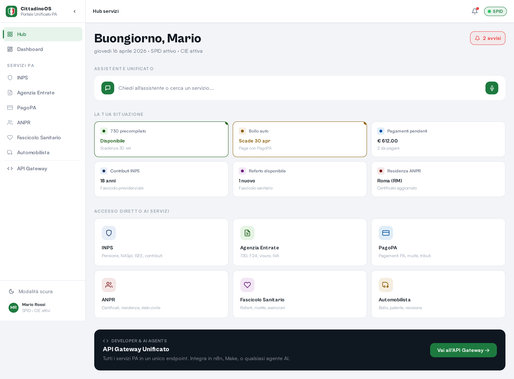
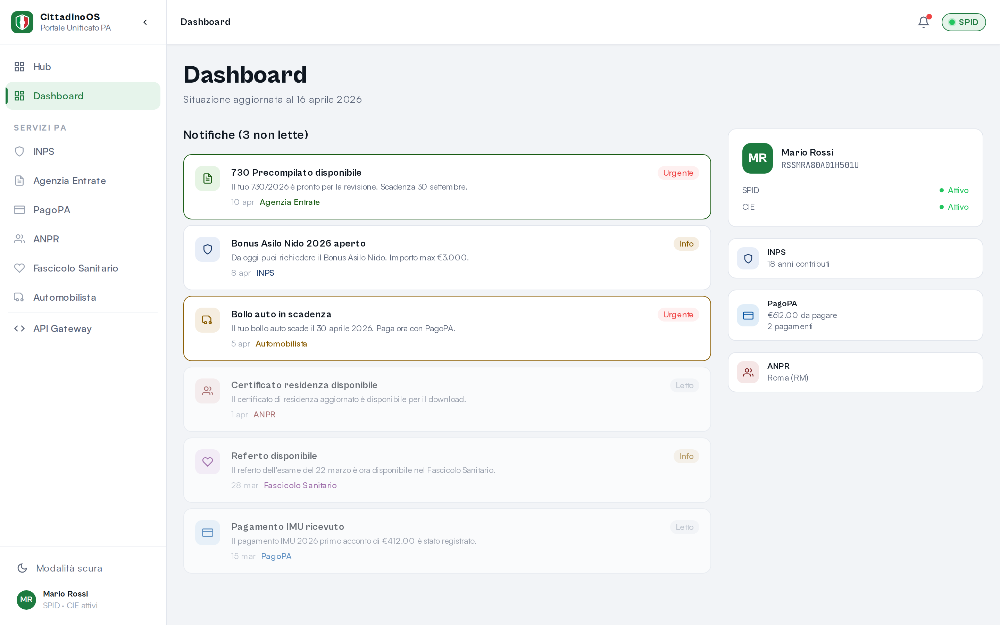
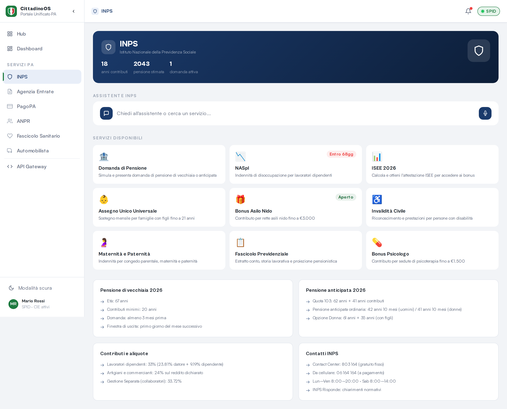
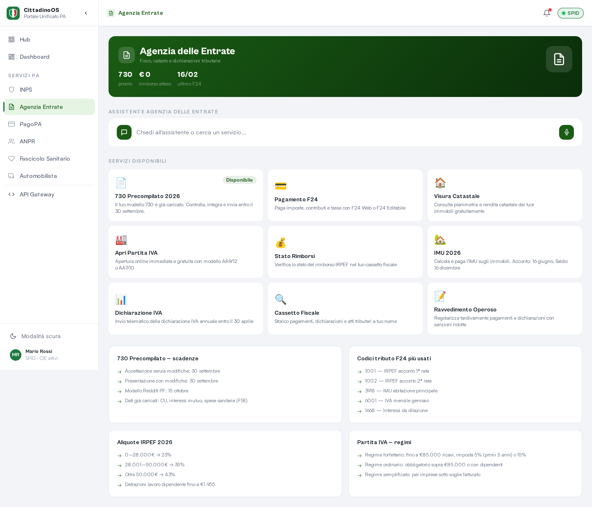
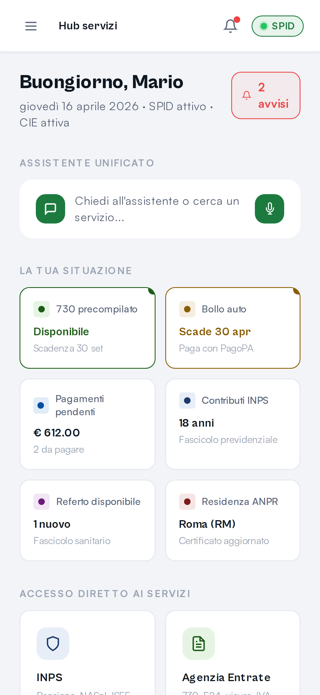
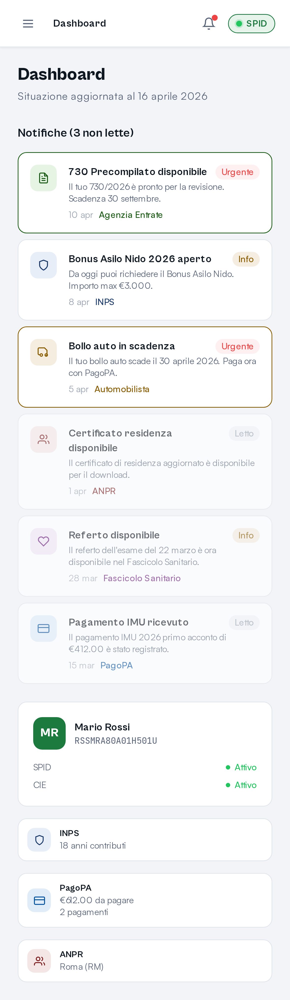
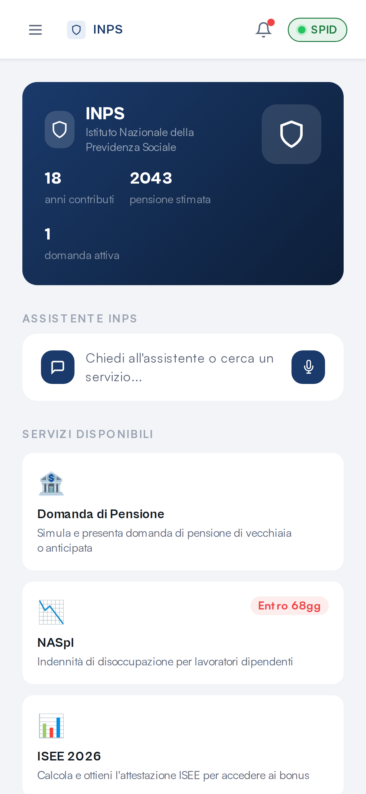
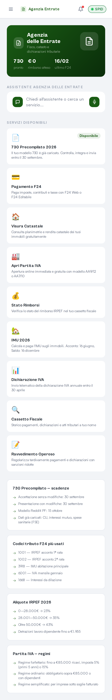
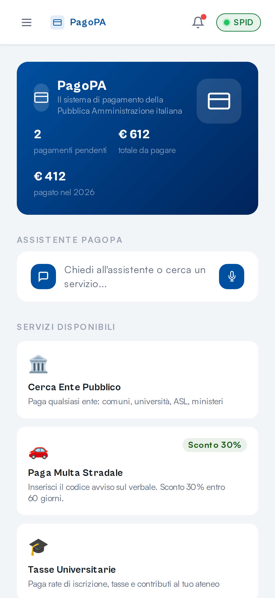
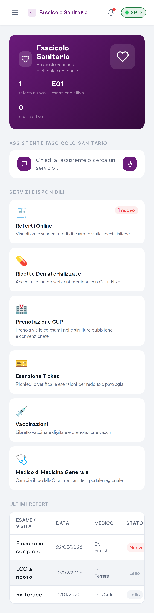

# 🇮🇹 Portale Italia

> **Il layer di orchestrazione che unifica i servizi della PA italiana in un'unica interfaccia conversazionale.**

> ⚠️ **PoC educativo e di advocacy.** Le pratiche e i servizi personali dell’interfaccia sono simulati; non sono collegati ai sistemi operativi della PA. Il backend MCP separato consulta soltanto dati istituzionali pubblici IPA. Nessun dato personale del cittadino è richiesto per questi lookup.

🔗 **Live Demo:** [portale-italia.online](https://portale-italia.online)

## Backend MCP

Il pacchetto autonomo [`mcp-server/`](mcp-server/README.md) espone due tool reali sull’Indice PA: ricerca di enti e consultazione dei loro uffici della transizione digitale. Supporta stdio e Streamable HTTP locale, con fonti, licenze e date distinte per dataset e singolo record. Non è ancora collegato all’interfaccia della live demo e non compie operazioni amministrative.

- [Istruzioni e perimetro del backend](mcp-server/README.md)
- [Mappa degli interlocutori e schema del sistema](docs/strategy/piano-agentico-pa.md)
- [Ricerca sulle API e MCP pubblici già esistenti](docs/research/agentic-pa-apis.md)
- [Proposta di pilota per i partner](docs/strategy/brief-pilota.md)
- [Piano hosting VPS Linux](docs/strategy/hosting-vps.md)

## Demo agentica verificata in ChatGPT

Il 1 ottobre 2026 la [demo MCP separata](mcp-server/demo/README.md) è stata collegata a ChatGPT con OAuth: componente grafico incorporato, disponibilità, preparazione, conferma nella pagina demo e lettura della ricevuta. Le prenotazioni e le identità sono sintetiche; nessun servizio PA transazionale è collegato. Annullamento disponibile nella pagina; modifica appuntamento ancora da implementare. La connessione corrente usa un tunnel temporaneo dal Mac: hosting stabile non ancora attivo. Non è una pubblicazione nel catalogo pubblico delle app.

## 🚀 Cosa fa

- **Hub unificato:** INPS, Agenzia Entrate, PagoPA, ANPR, Fascicolo Sanitario, Automobilista — tutto in un posto
- **Assistente AI integrato (sperimentale):** Un prototipo di guida conversazionale per aiutare il cittadino a trovare il servizio giusto (es. "dove pago il bollo?")
- **Dark mode nativa**
- **Design accessibile e responsive** — funziona su desktop e mobile
- **API Gateway unificato** per sviluppatori e agenti AI

## 🌐 Benchmark Internazionali

Il pattern architetturale segue modelli già adottati in altri paesi:

- **🇪🇪 Estonia — Bürokratt:** Assistente AI unificato (dal 2020) che aggrega servizi pubblici eterogenei in un'interfaccia conversazionale accessibile via testo, voce o lingua dei segni. [→ e-estonia](https://e-estonia.com/estonia-and-automated-decision-making-challenges-for-public-administration/)
- **🇬🇧 UK — AI Opportunities Action Plan 2025:** Governo britannico con partnership Anthropic per costruire un AI assistant per i servizi pubblici. Risparmio stimato: £45 miliardi/anno. [→ techUK](https://www.techuk.org/resource/uk-government-brings-further-ai-capability-into-public-services.html)
- **🇸🇬 Singapore — Singpass:** 2.700 servizi di 800 enti accessibili da una singola identità digitale unificata. 41 milioni di transazioni al mese. [→ tech.gov.sg](https://www.tech.gov.sg/products-and-services/for-citizens/digital-services/singpass/)

## 📸 Screenshot

### Desktop

| Hub | Dashboard |
|-----|-----------|
|  |  |

| INPS | Agenzia Entrate |
|------|-----------------|
|  |  |

### Mobile

| Hub | Dashboard | INPS |
|-----|-----------|------|
|  |  |  |

| Agenzia Entrate | PagoPA | Salute |
|-----------------|--------|--------|
|  |  |  |

## 🎨 Design System

Portale-Italia utilizza il token set ufficiale [`design-tokens-italia`](https://github.com/italia/design-tokens-italia) per garantire la conformità alle linee guida di design AgID. I colori del brand personalizzato (verde Italia) si sovrappongono ai token ufficiali per spaziatura, tipografia, raggi e ombre.

- **Token:** spaziatura (`--it-spacing-*`), dimensioni font (`--it-font-size-*`), ombre, raggi
- **Personalizzati:** `--color-brand` (#1d7a3f), colori specifici per modulo, estensioni tema scuro
- **Risultato:** accessibile WCAG AA, allineato AGID, Lighthouse 91+ mobile

## 🏗 Architettura

```
┌─────────────────────────────────────────┐
│           Portale Italia UI             │
│  React 18 + Vite + Tailwind + wouter    │
├─────────────────────────────────────────┤
│          API Gateway Layer              │
│     /api/v1/notifications               │
│     /api/v1/citizen/profile             │
│     /api/v1/agent/query                 │
├─────────────────────────────────────────┤
│        Servizi PA (simulati)            │
│  INPS │ Entrate │ PagoPA │ ANPR │ ...   │
└─────────────────────────────────────────┘
```

Non sostituisce i database statali. Agisce come layer di orchestrazione sopra i sistemi legacy, formatta i dati e li espone tramite API unificata.

## ⚡ Setup

```bash
npm install
npm run dev      # Sviluppo su localhost
npm run build    # Build produzione
```

## 📂 Struttura

```
client/src/
├── pages/          # Pagine (Dashboard, INPS, Entrate, PagoPA, ...)
├── components/     # AppShell, AgentWidget, componenti UI
├── hooks/          # use-toast, use-mobile
└── lib/            # Utils, queryClient

server/             # Backend Express
shared/             # Schema condiviso
```

## 🤝 API Gateway

Portale Italia espone un API Gateway REST unificato con contratto documentato **OpenAPI 3.0** e standard AGID. Tutte le risorse richiedono autenticazione SPID/CIE.

- 📄 **Spec:** [OpenAPI.yaml](./OpenAPI.yaml)
- 🔗 **Sandbox:** `https://portale-italia.online/api/v1`

<table>
<tr><td><code>POST /api/v1/agent/query</code></td><td>Query assistente AI</td></tr>
<tr><td><code>GET /api/v1/services</code></td><td>Catalogo servizi PA</td></tr>
<tr><td><code>GET /api/v1/notifications</code></td><td>Notifiche aggregate</td></tr>
<tr><td><code>GET /api/v1/citizen/profile</code></td><td>Profilo cittadino</td></tr>
</table>

## 🏛 Collaborazione Istituzionale

Se lavori in un ente PA, in AgID, nel Dipartimento per la Trasformazione Digitale, o ti occupi di interoperabilità dei dati pubblici in Italia, scrivici per parlare di come portare questa architettura su dati reali.

Il progetto è catalogato su [Developers Italia](https://developers.italia.it) tramite `publiccode.yml`.

📬 **Contatti:** portale@sephmartin.com

## 🤝 Contribuire

Contributi benvenuti. Apri una issue o una PR.

Per proposte di collaborazione istituzionale o commerciale: **portale@sephmartin.com**

## ⚖️ Licenza

**AGPLv3** — Sei libero di usare, studiare e modificare questo codice. Qualsiasi servizio web erogato usando questo codice (anche modificato) deve rendere pubblico il proprio sorgente.

Per uso commerciale senza vincolo AGPL: contattami per una licenza enterprise.

---

*— Seph Martin*
