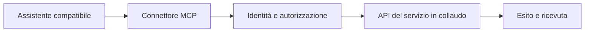

# Portale Italia — proposta di pilota MCP

**Versione 0.3 — 1 ottobre 2026**

## Obiettivo

Permettere a un cittadino di usare un assistente compatibile per completare un singolo flusso di servizio pubblico attraverso API autorizzate. Il progetto propone connettori open source basati sul protocollo MCP, riusabili tra più client e, dove la piattaforma lo consente, più enti.

## Già realizzato

- Prototipo di interfaccia per illustrare il servizio; le pratiche personali mostrate sono simulate.
- Backend MCP autonomo con due funzioni reali: cercare un ente nell’Indice PA e recuperare il suo ufficio digitale dal codice IPA esatto.
- Risultati con fonte, licenza e date del dataset e del record; nessuna credenziale richiesta per questi dati pubblici.
- Verifica con client MCP su stdio e HTTP locale: dieci controlli live e dieci su dati artificiali.

- Demo ibrida collegata al vero ChatGPT con OAuth PKCE: widget incorporato, disponibilità, preparazione, conferma della persona nella pagina demo, ricevuta letta dal chatbot. Annullamento provato nella pagina.

Questa versione non accede a posizioni personali e non esegue azioni amministrative reali. Utenti e appuntamenti sono sintetici. Il collegamento HTTPS usa ancora un tunnel temporaneo sul Mac; hosting stabile da completare.

## Pilota proposto

Un appuntamento con un ufficio: leggere disponibilità, scegliere uno slot, autenticare l’utente, confermare la richiesta, prenotare e restituire una ricevuta; successiva cancellazione su richiesta. Possiamo scegliere un flusso equivalente in base alle API già disponibili.

## Cosa chiediamo al partner

1. Referente del servizio e operatore tecnico della piattaforma.
2. API documentata e ambiente di collaudo con dati sintetici.
3. Un ente utilizzatore disponibile a concordare un perimetro circoscritto.
4. Modalità di autenticazione e autorizzazione dell’utente, conferma verificabile, prevenzione dei duplicati e cancellazione.
5. Ruoli, gestione delle credenziali, trattamento dei dati e supporto definiti prima delle operazioni reali.

Per un e-service su PDND si verifica anche la fruizione del soggetto ammesso e la finalità; un’API diretta può avere un diverso percorso di abilitazione. Il protocollo MCP non sostituisce i permessi del servizio.

## Risultato atteso

Una demo completa in collaudo con esito e ricevuta del sistema partner, codice del connettore riusabile e documentazione del flusso. L’estensione a un secondo client o ente sarà valutata dopo il primo risultato e con le autorizzazioni necessarie.

## Contesto internazionale

[Bürokratt in Estonia](https://www.ria.ee/en/state-information-system/artificial-intelligence) e [GOV.UK Chat](https://www.gov.uk/government/news/millions-to-get-faster-easier-access-to-government-support-with-new-ai-tool) offrono accesso conversazionale alle informazioni sui servizi pubblici. Negli Stati Uniti, l’[ordine su America.gov del 29 settembre 2026](https://www.whitehouse.gov/presidential-actions/2026/09/streamlining-access-to-government-services-through-america-gov/) indica anche integrazioni operative dove autorizzate e disponibili: è un mandato di sviluppo, non la prova che tutti i servizi siano già collegati. Queste esperienze motivano il pilota; non dimostrano l’adozione di MCP da parte degli enti citati.

Codice disponibile: [backend MCP e demo](https://github.com/sephmartin/portale-italia/tree/codex/mcp-demo-chatgpt/mcp-server), nel ramo proposto per revisione con [PR #1](https://github.com/sephmartin/portale-italia/pull/1). Licenza: AGPL-3.0-only. Nessun accordo o patrocinio istituzionale è attualmente dichiarato.
