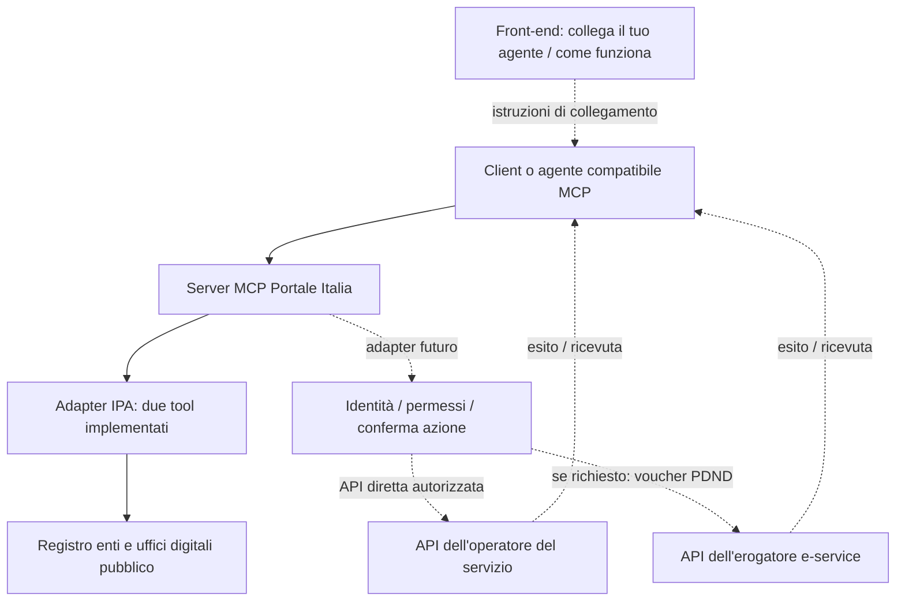

# Portale Italia: percorso verso un pilota agentico PA

**1 ottobre 2026 — proposta operativa; ricerca degli interlocutori del 30 settembre.** Nessun contatto esterno inviato. Le disponibilità di API di collaudo e partner non sono ancora confermate.

## Valutazione

La direzione è valida: front-end semplice per collegare un agente compatibile, backend MCP aperto e adattatori riusabili per i servizi. La fattibilità di un MCP su dati pubblici è già dimostrabile; quella di un’azione su un servizio personale va ancora dimostrata con un partner.

L’esame del codice esistente ha trovato risposte del chatbot basate su parole chiave e dati simulati, sia nel widget sia nelle route server. Il README del portale dichiara correttamente il perimetro PoC. Questa interfaccia non costituisce ancora un collegamento alle PA. Ora è stato aggiunto un pacchetto autonomo `mcp-server/` con due lookup reali IPA; è incluso nell’aggiornamento del repository per revisione, separato dall’interfaccia del portale. La demo MCP con OAuth e widget è stata provata nel vero ChatGPT il 1 ottobre, con sole operazioni sintetiche.

La differenza che conta per il progetto sarà un’operazione autorizzata e riusabile, con esito tracciabile. I soli wrapper di open data sono utili per iniziare, ma esistono già MCP pubblici di AgID e Developers Italia: il modello “un altro chatbot su dati pubblici” offre una differenziazione limitata. Fonti e verifiche nella [ricerca API](../research/agentic-pa-apis.md).

## Dobbiamo contattare ogni comune?

**No. Scegliere il servizio e individuare la piattaforma che lo gestisce.** Ogni PA deve individuare la funzione RTD/UTD, ma per le PA diverse dallo Stato l’ufficio può essere associato: Unione di Comuni o convenzione, con coinvolgimento di Province, Regioni e società in house. Quindi non esiste una corrispondenza uno-a-uno “comune = piattaforma = ufficio autonomo”. Questo non elimina il ruolo di ogni ente titolare.

Fonte: [Vademecum AgID sulla nomina associata](https://www.agid.gov.it/it/agenzia/piano-triennale/strumenti/strumento-6); [report AgID pubblicato il 27 gennaio 2026](https://www.agid.gov.it/it/notizie/nomina-rtd-forma-associata-pubblicate-le-risultanze-del-laboratorio-dedicato). Il report mostra che una gestione condivisa efficace richiede risorse e governance stabili, non solo un referente in comune.

| Caso scelto | Prima porta | Quando coinvolgere il singolo ente |
|---|---|---|
| Dato pubblico nazionale | Gestore del dataset/API; spesso basta l’API già pubblica | Se occorre chiarire un record o una fonte |
| Servizio nazionale centralizzato | Titolare ed erogatore del servizio | Quando il flusso specifico coinvolge un ufficio locale |
| Servizio comunale su piattaforma condivisa | Operatore regionale/in house o fornitore della piattaforma | Per scegliere il pilota e concordarne uso, autorizzazioni e responsabilità |
| Servizio su software locale autonomo | RTD/UTD dell’ente e gestore del software | Dall’inizio del pilota |

La sede geografica di una società non prova il territorio o i servizi coperti. Uno stesso nominativo RTD in più record IPA è un indizio: confermare formalmente quale gestione associata e quale piattaforma esistano.

## Prima ondata: cinque interlocutori, due percorsi in parallelo

Priorità P1 = avviare ricerca del partner e chiarire il percorso di accesso; P2 = indirizzo nazionale e confronto tecnico, senza aspettare un patrocinio per sviluppare il codice pubblico. La priorità è una nostra scelta, non un impegno dell’organizzazione.

| Priorità / destinatario | Richiesta precisa | Perché è pertinente | Canale verificato |
|---|---|---|---|
| P1 — Lepida | Referente tecnico del Fascicolo del Cittadino; API documentate e collaudo per un solo flusso; uno o due enti pilota | Nel maggio 2026 dichiara un’indagine con 80 enti, con proposte su PDND, IO e chatbot | `segreteria@lepida.it`; chiedere inoltro al responsabile della piattaforma |
| P1 — Assinter Italia | Introduzione a 1–2 società in house con API operative e un ente interessato | Rete di società ICT pubbliche nazionali, regionali e locali | `segreteria@assinteritalia.it` |
| P1 — PagoPA / PDND | Percorso per il soggetto del progetto, ambienti, requisiti del singolo e-service, ruolo eventuale del partner | Gestore della piattaforma PDND; l’apertura alle imprese è documentata | Assistenza nell’Area Riservata; prima dell’adesione serve verificare un canale abilitato al quesito |
| P2 — AgID | Ufficio competente per interoperabilità, riuso e confronto sul modello del pilota | Linee guida tecniche e coordinamento; reti RTD | `protocollo@pec.agid.gov.it`, documentato come ricevente anche posta ordinaria |
| P2 — DTD | Referente dei servizi/interoperabilità e iniziative di sperimentazione pertinenti | Coordinamento delle politiche di trasformazione digitale | `segreteria.trasformazionedigitale@governo.it` |

Fonti: [Lepida, aggiornamenti maggio 2026](https://www.lepida.net/news/2026-05/aggiornamenti-pnrr); [rete e contatti Assinter](https://www.assinteritalia.it/it/page/network); [assistenza PDND](https://developer.pagopa.it/pdnd-interoperabilita/quick-start); [instradamento richieste AgID](https://www.agid.gov.it/it/node/1627); [contatti DTD](https://innovazione.gov.it/contatti/).

**Limite del canale PagoPA:** il sito PDND collega “Assistenza” alle [issue GitHub](https://github.com/pagopa/pdnd-interop-frontend/issues), ma il repository limita la creazione di nuove issue. Non abbiamo ancora verificato l’abilitazione di un account. Non va trattato come un contatto inviabile garantito. Il DevPortal indica ticket dall’Area Riservata. Nessun indirizzo email generico è stato inventato.

**Alternativa regionale:** CSI Piemonte, rete Assinter. La pagina [contatti CSI](https://www.csipiemonte.it/it/contatti) pubblica `protocollo@cert.csi.it`; riceve PEC oppure posta ordinaria con allegati firmati digitalmente. Non usarla come una normale casella email per un messaggio informale. Non abbiamo ancora verificato una API attuale adatta al pilota. Per altre regioni usare la rete Assinter per scegliere gli operatori, poi verificare prodotto, titolare e referente.

L’indagine di Lepida dimostra un bisogno pertinente; non dimostra una API pubblica, né accettazione del nostro progetto. Assinter può facilitarci un’introduzione; non concede accesso ai dati degli associati. DTD e AgID possono orientare e coordinare; una risposta positiva non sostituisce i permessi del servizio.

## PDND: cosa correggiamo nella strategia

Dal 15 gennaio 2026 PagoPA annuncia l’adesione di tutte le imprese iscritte al Registro Imprese come erogatori e fruitori: [notizia ufficiale](https://www.interop.pagopa.it/news/apertura-privati). La vecchia pagina v1.0 del manuale non va usata per sostenere che qualsiasi privato sia ancora escluso.

Restano da verificare il soggetto concreto del progetto, ambiente e requisiti dell’e-service. Non sappiamo se il pilota sarà portato da un’impresa del progetto, da una PA partner o da un operatore autorizzato. Non assumere che una persona fisica o qualsiasi partita IVA equivalga a un’impresa ammessa.

Il voucher PDND abilita il client del soggetto fruitore per una finalità: l’identità del cittadino e il diritto di operare per lui richiedono un flusso specifico. Una prenotazione su una piattaforma locale può inoltre passare da API dirette autorizzate, senza PDND. La scelta dipende dal servizio, non dal fatto di usare MCP. Fonte sul flusso: [Quick Start PDND](https://developer.pagopa.it/pdnd-interoperabilita/quick-start).

## Chi si assume la responsabilità?

Il pilota deve avere una decisione e ruoli espliciti. Questa è una proposta organizzativa da concordare, non una qualificazione giuridica già verificata:

| Soggetto | Impegno da definire nel pilota |
|---|---|
| PA titolare del servizio e responsabile del suo procedimento | Decide il perimetro ammesso, il flusso amministrativo e chi può agire |
| RTD/UTD | Coordina interlocutori, processo digitale e integrazione; non è automaticamente l’unico firmatario |
| Gestore della piattaforma / erogatore API | Fornisce ambiente, contratto API, autenticazione, supporto e autorizzazioni tecniche pertinenti |
| Soggetto fruitore, quando si usa PDND | Richiede la fruizione, configura finalità/client e custodisce le proprie chiavi |
| Progetto Portale Italia / manutentore del connettore | Mantiene il codice, limita le operazioni, gestisce errori e tracciamento secondo l’accordo |
| Cittadino | Si autentica e conferma l’azione con un meccanismo verificabile |

Prima di dati personali o azioni reali va definito anche chi gestisce l’hosting e i dati, quali informazioni arrivano al modello, conservazione e ruoli privacy/contrattuali. Una licenza open source o un generico sponsor istituzionale non definiscono questi ruoli. Per la prima sperimentazione chiediamo dati sintetici e un ambiente di collaudo.

## Sistema: implementato e da concordare

La separazione front-end/backend proposta da Seph è corretta. Il sito spiega il collegamento e mostra la demo; il repository contiene adapter, schema e limiti. Il backend IPA supporta stdio e HTTP locale; la demo separata dispone ora di HTTPS temporaneo e prova nel vero ChatGPT. L’hosting indipendente dal Mac resta da completare. L’app esistente non è stata riscritta in questa fase.

## Primo pilota candidato

**Appuntamento con un ufficio:** leggere disponibilità → proporre uno slot → autenticazione e conferma → prenotare → restituire ricevuta → cancellare se richiesto. È una nostra ipotesi iniziale, subordinata ad API e partner disponibili. L’obiettivo è contenere complessità e conseguenze rispetto a servizi che decidono benefici o rilasciano atti.

Chiedere al partner:

1. Quale singolo flusso è già coperto da API e chi lo autorizza?
2. Specifica OpenAPI o equivalente, versione, errori e limiti.
3. Ambiente di collaudo con dati sintetici e credenziali del soggetto ammesso.
4. Modalità di identità/delega del cittadino; non basta un booleano “confermato” passato dal modello.
5. Uno o due enti utilizzatori, referente del servizio e operatore tecnico.
6. Ricevuta, prevenzione dei duplicati, revoca e supporto per gli errori.

**Via libera al pilota** quando esistono API documentata, autorizzazione di collaudo e referenti nominati. Se una piattaforma non ha API/ambiente o non vuole il pilota, passare al candidato successivo. Non fare dipendere tutto da una risposta del Governo o da migliaia di email ai comuni.

## Sequenza proposta

1. Pubblicare il pacchetto MCP e questo schema, con licenza AGPL già dichiarata dal progetto e metadati ora allineati; poi renderli raggiungibili dalla pagina esistente.
2. Avviare richieste mirate a Lepida e Assinter; in parallelo chiarire PDND e indirizzamento con AgID/DTD. Bozze e registro contatti sono documenti operativi locali; nessun invio istituzionale effettuato.
3. Selezionare **un** flusso da ciò che il partner può già abilitare, con preferenza iniziale per gli appuntamenti.
4. Portare un secondo adapter in collaudo e registrare una demo con ricevuta vera del sistema di test.
5. Dimostrare la portabilità su due client e poi riusare l’adapter su un secondo ente della stessa piattaforma, se autorizzato.

La verifica del backend è registrata in [evidenza MCP](../../mcp-server/verification/live.json). Questa prova non certifica l’accesso a servizi personali, la fattibilità contrattuale del pilota o un’azione PA reale. Il collegamento ChatGPT della demo sintetica è documentato separatamente in [prova manuale](../../mcp-server/verification/chatgpt-manual.json).
